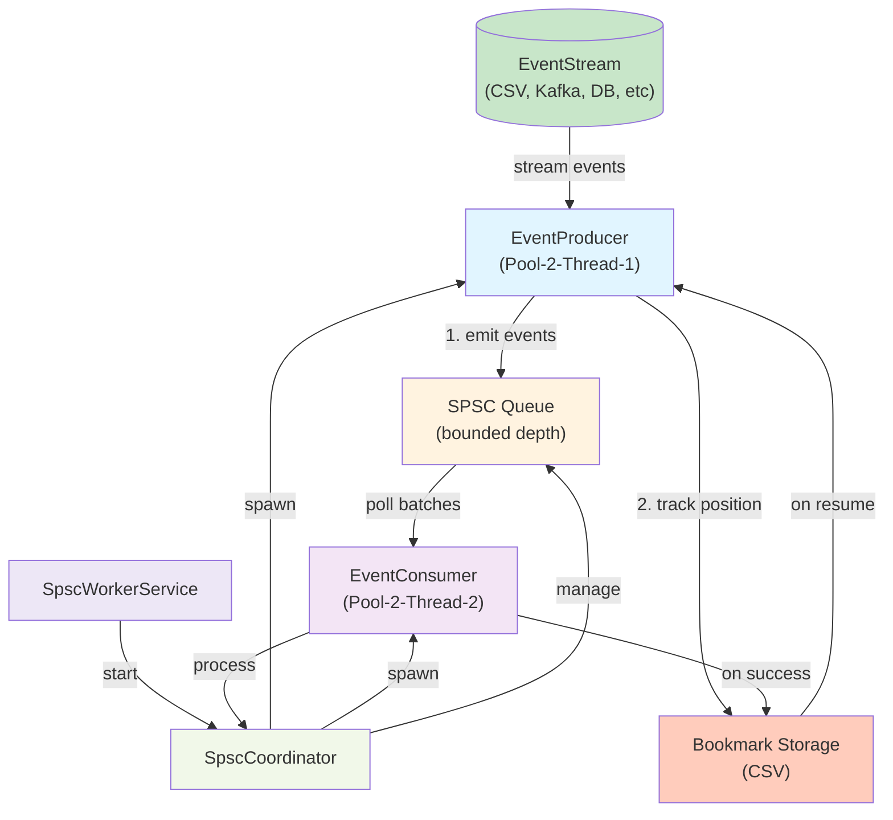

# Spring Boot Worker Service Playground

A minimal Spring Boot worker service application (non-web) for experimenting with background processing, scheduled tasks, and reactive data access patterns using Kotlin, R2DBC, and PostgreSQL.

This is a starting point and playground for building Spring Boot applications that don't need HTTP endpoints—perfect for background workers, batch processors, queue consumers, and scheduled jobs.

## Branch Structure

- **SPRINGB-BASIC**: Simple Kotlin/Spring Boot setup with single project containing core dependencies for building non-web apps, reactive web apps (WebFlux), and reactive PostgreSQL access (R2DBC)
- **SPRINGB-MULTI**: Multi-module Spring Boot project with layered architecture (core, domain, integration, http, worker)
- **main**: Core tech stack and baseline project structure
- **Feature branches**: Specific implementations and challenges (see [Project Branches](#-project-branches) below)

## 🛠️ Technology Stack

- **Kotlin**: 2.2.21
- **Java**: 21 (LTS)
- **Gradle**: 9.x (wrapper)
- **Spring Boot**: 3.5.8
- **Web**: Spring WebFlux (reactive)
- **Data**: Spring Data R2DBC; PostgreSQL via `r2dbc-postgresql` with pooling (`r2dbc-pool`)
- **JSON**: Jackson Module Kotlin
- **Testing**: `spring-boot-starter-test`, Reactor Test, `kotlin.test`
- **Build Script**: Kotlin DSL (`build.gradle.kts`)
- **Profiles**: `api` (reactive web), `worker` (no web)

## 🏗️ How This Project Was Initialized

This project was created using Gradle's interactive `init` command with the following selections:

1. **Build Type**: Application
2. **Language**: Kotlin
3. **Java Version**: 21
4. **Project Name**: my-app
5. **Structure**: Single application project
6. **Build Script DSL**: Kotlin
7. **Test Framework**: kotlin.test
8. **New APIs**: Enabled (for latest features)

### Setup Commands Used:

```bash
# Update to latest Gradle
sdk install gradle 9.0.0

# Update to latest Kotlin (while keeping 2.1.0 for work projects)
sdk install kotlin 2.2.0
sdk use kotlin 2.2.0

# Initialize the project
gradle init
```

## 📁 Project Structure

```
my-app/
├── app/                          # Main application module
│   ├── build.gradle.kts         # Build configuration (Kotlin DSL)
│   └── src/
│       ├── main/kotlin/         # Your Kotlin source code
│       │   └── org/example/App.kt
│       ├── main/resources/      # Resources
│       ├── test/kotlin/         # Test code
│       │   └── org/example/AppTest.kt
│       └── test/resources/      # Test resources
├── settings.gradle.kts          # Project settings
├── gradle.properties           # Gradle properties
├── gradlew                     # Gradle wrapper (Unix)
├── gradlew.bat                 # Gradle wrapper (Windows)
└── README.md                   # This file
```

## 🚀 Getting Started

### Spring Boot baseline (SPRINGB)

- Spring Boot: 3.5.8
- WebFlux + R2DBC (Postgres driver + pool)
- Java 21, Kotlin 2.2.x, Gradle 9

Run API mode (WebFlux):

```bash
./gradlew :app:bootRun --args='--spring.profiles.active=api'
# Test endpoint
curl http://localhost:8080/hello
```

Run background worker (no web):

```bash
./gradlew :app:bootRun --args='--spring.profiles.active=worker'
```

Configure Postgres via environment variables or .env file used by your shell:
- `R2DBC_URL` (default: r2dbc:pool:postgresql://localhost:5432/app)
- `DB_USERNAME` (default: postgres)
- `DB_PASSWORD` (default: postgres)

### Prerequisites

- **Java 17+** (JDK 21 recommended)
- **No need to install Gradle** - the project includes Gradle Wrapper

### Running the Application

```bash
# Run the main application
./gradlew run
```

Expected output:
```
Hello World!
```

### Running Tests

```bash
# Run all tests
./gradlew test
```

### Building the Project

```bash
# Clean and build the project
./gradlew clean build
```

### Other Useful Commands

```bash
# View project dependencies
./gradlew dependencies

# View available tasks
./gradlew tasks

# Generate distribution archives
./gradlew assembleDist
```

## 🔧 Development Setup

### IntelliJ IDEA

1. **Open IntelliJ IDEA**
2. **File** → **Open**
3. **Select the project directory** (`/path/to/your/project`)
4. **IntelliJ will automatically detect** it as a Gradle project and import it
5. **Wait for Gradle sync** to complete

The IDE will automatically configure:
- Kotlin plugin
- Gradle integration
- Java 21 SDK
- Project structure

### VS Code

1. **Install extensions**:
   - Kotlin Language
   - Gradle for Java
2. **Open the project directory**
3. **Run Gradle sync** when prompted

## ⚡ Performance Features

This project includes several performance optimizations enabled by default:

- **Configuration Cache**: Speeds up subsequent builds
- **Build Cache**: Reuses outputs from previous builds
- **Parallel Execution**: Runs tasks in parallel when possible

These are configured in `gradle.properties`:
```properties
org.gradle.configuration-cache=true
org.gradle.parallel=true
org.gradle.caching=true
```

## 🧪 Testing

The project uses **kotlin.test** framework for unit testing. Tests are located in:
- `app/src/test/kotlin/org/example/AppTest.kt`

### Adding New Tests

Create new test files in the `app/src/test/kotlin/` directory following the same package structure as your source code.

Example test:

```kotlin
class MyTest {
    @Test 
    fun `should do something`() {
        // Test implementation
        assertEquals(expected = "Hello", actual = "Hello")
    }
}
```

## 📦 Dependencies

Current dependencies are managed in `app/build.gradle.kts`:

- **Kotlin Standard Library**: Kotlin standard library (implementation)
- **Kotlin Test (JUnit5)**: Kotlin test library with JUnit5 support
- **JUnit Jupiter Engine**: JUnit5 test engine
- **JUnit Jupiter Params**: Parameterized tests support

### Adding New Dependencies

Add dependencies to `app/build.gradle.kts`:

```kotlin
dependencies {
    implementation("group:artifact:version")
    testImplementation("group:test-artifact:version")
}
```

## 🔄 Version Management

If you need to switch Kotlin versions (useful for work projects):

```bash
# Switch to Kotlin 2.1.0 (work projects)
sdk use kotlin 2.1.0

# Switch back to Kotlin 2.2.0 (personal projects)  
sdk use kotlin 2.2.0

# Check available versions
sdk list kotlin
```

## 🌱 Project Branches

This repository uses a branch-based approach for different projects and experiments:

### 🧩 SUDOKO

**Branch**: `SUDOKO`  
**Status**: ✅ Complete

A full-featured Sudoku solver implementation with CLI interface.

**Features:**
- Backtracking algorithm implementation
- Command-line solver supporting single and multiple puzzles
- Statistics tracking (steps, backtracks, solve time)
- Immutable puzzle solving (original puzzle preserved)
- Comprehensive test coverage
- Beautiful console output with puzzle visualization

**Key Components:**
- `Puzzle.kt` - Main puzzle representation (data class)
- `BacktrackingSolver.kt` - Backtracking algorithm implementation
- `App.kt` - CLI interface for solving puzzles
- Outcome pattern with `Success`/`Failure` types
- Stats tracking with performance metrics

**Usage:**
```bash
git checkout SUDOKO
./gradlew run --args="530070000600195000098000060800060003400803001700020006060000280000419005000080079"
```

**Performance:**
- Easy puzzles: ~8,000 steps, ~4,000 backtracks, <30ms
- Medium puzzles: ~15,000 steps, ~7,000 backtracks, <50ms
- Hard puzzles: ~50,000+ steps, ~25,000+ backtracks, <200ms

See `app/README.md` on the SUDOKO branch for detailed documentation.

---

---

### 🔄 SPRINGB-BASIC__ES-AND-SPSC

**Branch**: `SPRINGB-BASIC__ES-AND-SPSC`  
**Status**: ✅ Complete

Event Streaming architecture with Single Producer, Single Consumer (SPSC) pattern for processing events from CSV sources. Perfect for background workers that need to process large event streams reliably with position tracking and resumable consumption.

**Key Components:**
- `EventStream` - Interface for event sources (CSV, Kafka, DB, etc.)
- `CSVEventStream` - CSV file implementation with bookmark persistence
- `EventProducer` - Wraps raw events with position tracking
- `EventConsumer` - Processes event batches with automatic bookmark management
- `SpscCoordinator` - Orchestrates producer and consumer on separate threads
- `StreamedEvent` - Event wrapper containing position information

**Documentation:**  
See [./docs/EventStreaming.md](./docs/EventStreaming.md) for complete architecture details, API documentation, and design decisions.

**Quick Start:**

1. **Create test data:**
   ```bash
   mkdir -p ../data
   cat > ../data/events.csv << 'EOF'
   ORDER_ID,CUSTOMER_ID,EVENT_TYPE,TIMESTAMP
   1001,CUST001,ORDER_PLACED,1705058400000
   1002,CUST002,ORDER_PLACED,1705058700000
   1003,CUST001,ORDER_CONFIRMED,1705059000000
   1004,CUST003,ORDER_PLACED,1705059300000
   1005,CUST002,ORDER_CANCELLED,1705059600000
   EOF
   ```

2. **Run in test mode (processes all events and exits):**
   ```bash
   ./gradlew bootRun --args='--APP_SPSC_CSV_PATH=../data/events.csv --APP_SPSC_PRODUCER_EMPTY_BATCH_THRESHOLD=3'
   ```

3. **Run in production mode (runs indefinitely):**
   ```bash
   APP_SPSC_CSV_PATH=../data/events.csv APP_SPSC_PRODUCER_EMPTY_BATCH_THRESHOLD=0 ./gradlew bootRun
   ```

4. **Control logging levels:**
   ```bash
   ./gradlew bootRun --args='--APP_SPSC_CSV_PATH=../data/events.csv --logging.level.org.example=INFO'
   ```

5. **Different batch sizes:**
   ```bash
   ./gradlew bootRun --args='--APP_SPSC_CSV_PATH=../data/events.csv --APP_SPSC_PRODUCER_BATCH_SIZE=10 --APP_SPSC_CONSUMER_BATCH_SIZE=5'
   ```

**Configuration:**

| Setting             | Env Var                                   | Default            | Purpose                              |
|---------------------|-------------------------------------------|--------------------|--------------------------------------|
| CSV Path            | `APP_SPSC_CSV_PATH`                       | `./events.csv`     | Event source file                    |
| Producer Batch Size | `APP_SPSC_PRODUCER_BATCH_SIZE`            | `2`                | Events fetched per iteration         |
| Consumer Batch Size | `APP_SPSC_CONSUMER_BATCH_SIZE`            | `2`                | Events processed per call            |
| Queue Depth         | `APP_SPSC_MAX_QUEUE_DEPTH`                | `5`                | Max queued events                    |
| Exit Threshold      | `APP_SPSC_PRODUCER_EMPTY_BATCH_THRESHOLD` | `0`                | Exit after N empty batches (0=never) |
| Bookmark Name       | `APP_SPSC_BOOKMARK_NAME`                  | `default-consumer` | Consumer progress identifier         |

**Bookmark Management:**

Bookmarks track consumer progress as CSV files in the data directory:

```bash
# View current bookmark
cat ../data/default-consumer.csv
# Output: POSITION,TIMESTAMP
#         5,1705059600000

# Start fresh (delete bookmark)
rm ../data/default-consumer.csv
./gradlew bootRun --args='--APP_SPSC_CSV_PATH=../data/events.csv --APP_SPSC_PRODUCER_EMPTY_BATCH_THRESHOLD=3'

# Multiple consumers with different bookmarks
APP_SPSC_BOOKMARK_NAME=consumer-1 ./gradlew bootRun &
APP_SPSC_BOOKMARK_NAME=consumer-2 ./gradlew bootRun &
```

**Generate Test Data:**

Small dataset:
```bash
cat > ../data/events-small.csv << 'EOF'
ORDER_ID,CUSTOMER_ID,EVENT_TYPE,TIMESTAMP
1001,CUST001,ORDER_PLACED,1705058400000
1002,CUST002,ORDER_CONFIRMED,1705058700000
EOF
```

Large dataset (1000 events):
```bash
printf "ORDER_ID,CUSTOMER_ID,EVENT_TYPE,TIMESTAMP\n" > ../data/events-large.csv
for i in {1..1000}; do
  printf "%d,CUST%03d,ORDER_PLACED,%d\n" $((10000 + i)) $((i % 100)) $((1705058400000 + i * 1000)) >> ../data/events-large.csv
done
```

**Running Tests:**

```bash
# All tests (32 tests)
./gradlew test

# Integration tests
./gradlew test --tests "*IntegrationTests"

# Event stream tests
./gradlew test --tests "*EventStreamTests"
```

**Performance Notes:**
- Processes ~1000 events/second on standard hardware
- Minimal memory overhead (bounded queue prevents unbounded growth)
- Resumable from any position via bookmarks
- Thread-safe across producer/consumer boundary
- Default threshold (0) means producer runs indefinitely for production use
- Threshold > 0 useful for testing with finite event sources

**Architecture Diagram:**



**Flow Description:**
1. **EventProducer** (green) reads from EventStream in batches, wraps each event with position info, and puts it in the bounded queue
2. **SPSC Queue** (orange) ensures thread-safe, lock-free communication between producer and consumer
3. **EventConsumer** (purple) polls batches from queue, processes them, and on success advances the bookmark
4. **Bookmark Storage** (peach) persists consumer progress, enabling resumable processing from last position
5. **SpscCoordinator** (light green) orchestrates both threads, manages lifecycle, and coordinates shutdown
|
### Future Branches

Planned explorations:
- Graph algorithms (DFS, BFS, Dijkstra)
- Dynamic programming challenges
- Data structure implementations
- Design pattern examples

## 📚 Learn More

- [Kotlin Documentation](https://kotlinlang.org/docs/)
- [Gradle User Guide](https://docs.gradle.org/current/userguide/)
- [Building Kotlin Applications with Gradle](https://docs.gradle.org/9.0.0/samples/sample_building_kotlin_applications.html)
- [kotlin.test Documentation](https://kotlinlang.org/docs/kotlin-test.html)

## 🤝 Contributing

1. **Fork the project**
2. **Create a feature branch** (`git checkout -b feature/amazing-feature`)
3. **Commit your changes** (`git commit -m 'Add some amazing feature'`)
4. **Push to the branch** (`git push origin feature/amazing-feature`)
5. **Open a Pull Request**

---

**Happy Coding!** 🎉
